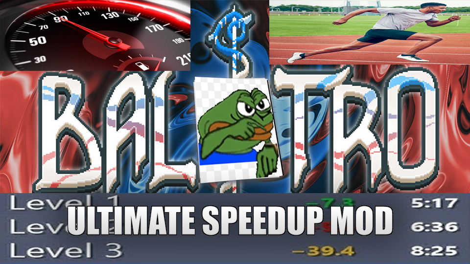

# A mod that speeds up everything* in Balatro.
**except sound because that would be weird*
Are you tired of downloading a bunch of animation speed-up animations? Do you watch all of your YouTube content in 2x because you have no attention span? Do you just want to *go fast:tm:*? This is the mod for you, then. This mod speeds up (or slows down) the entire game to your desired value.

## Instructions (Windows ONLY!)
- Download the latest release
- Go to your Balatro install folder
- Rename `luasteam.dll` to `luasteam.original.dll`
- Extract the latest release in your Balatro folder.
- (Optional) Modify `speedhax.cfg` to your desired value. (Default is `2.0`. If you go too overboard your game might fail to boot or just crash.)
- Profit!

## Notes
- This shouldn't but *might* break other mods. I haven't tested any of them and don't plan to. Open an issue if you really want me to fix a conflict, I might take a look.
- This might work via Wine, but I haven't tested it.

## How does it work?
I made a shim for `luasteam.dll` and then Import Adress Table hooked `kernel32!QueryPerformanceCounter` to speed up everything.

## Building (Windows ONLY!)
Either use CMake or build `speed.c` manually with any recent C/C++ compiler.